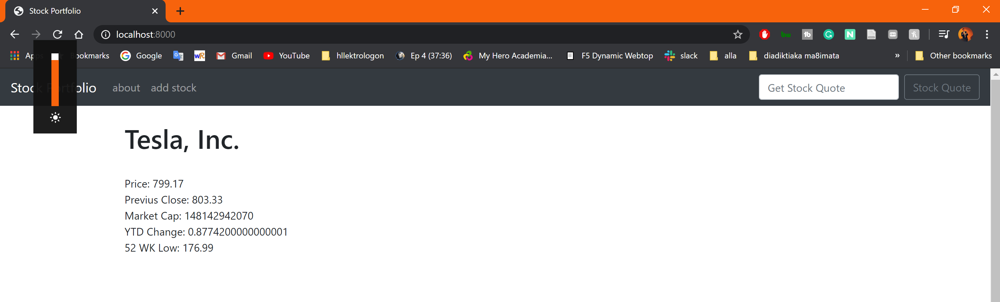
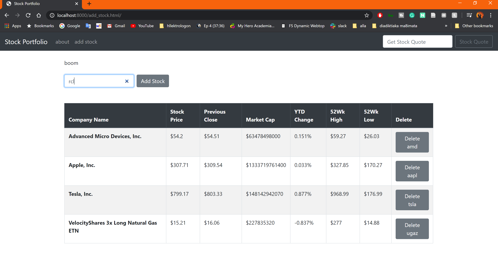

# Stock Portfolio Interactive Page - Python Django

Building a Dynamic Page with Django and Python that shows, Stock Portfolio using an API for Data Collection - Originally developed 10/10/2019

## In this project it was developed 
1. Interactive web page with Django
2. DataBase and User Base
3. API Connection for the collection of the stock data

## Results of the Project 

## What I learned from this Project
The main goal is to get familiar with the idea of web-development and in general, understand the capabilities of building software online
